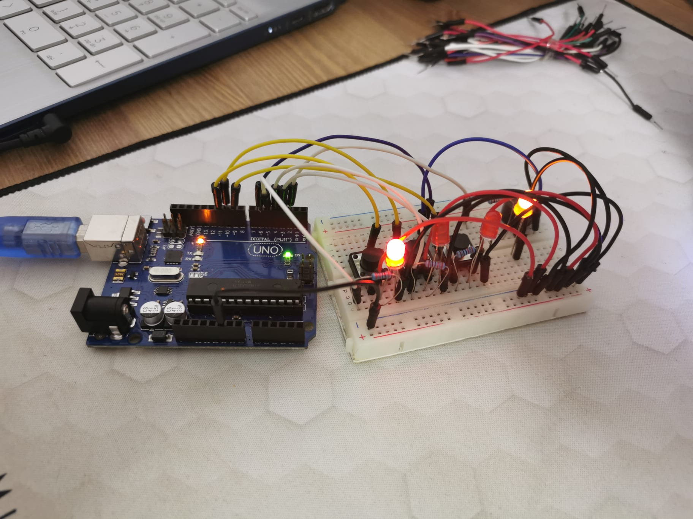

#                                                            Homework 3

This assignment involves simulating a 3-floor elevator control system using LEDs, buttons, and a buzzer with Arduino.

## Components
* LEDs x4
* Buttons x3
* Buzzer x1
* Resistors x4
* Wires x18

## Technical Task
Design a control system that simulates a 3-floor elevator using the Arduino platform. Here are the specific requirements:
• LED Indicators: Each of the 3 LEDs should represent one of the 3 floors. The LED corresponding to the current floor should light up. Additionally, another LED should represent the elevator’s operational state. It should blink when the elevator is moving and remain static when stationary.
• Buttons: Implement 3 buttons that represent the call buttons from the 3 floors. When pressed, the elevator should simulate movement towards the floor after a short interval (2-3 seconds).
• Buzzer: The buzzer should sound briefly during the following scenarios:
– Elevator arriving at the desired floor (something resembling a ”cling”).
– Elevator doors closing and movement (pro tip: split them into 2 different sounds)

## Setup

## Project difficulties 
- Making the led for the state of the elevator blink in the same time with the sound.
- Making 2 sounds play one after the other without delay.

## Video
https://youtu.be/ceZbHi4PxoA
