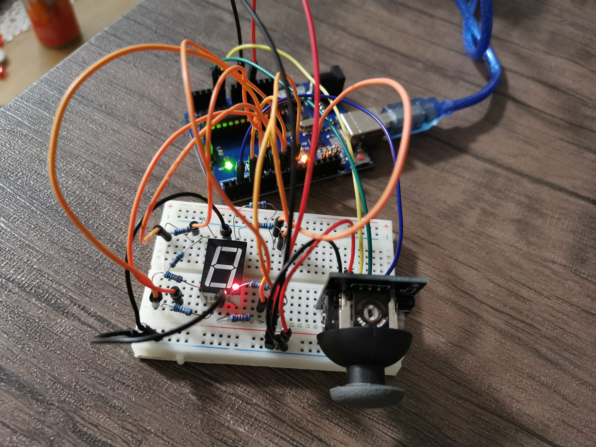

#                                                            Homework 4

This assignment involves using the joystick to control the position of the segment and ”draw” on the display.

## Components
* 7-segment display x1
* joystick x1
* Resistors x8
* Wires x16

## Technical Task
The initial position should be on the DP. The current position always blinks (irrespective of the fact that the segment is on or off). Use the joystick to move from one position to neighbors (see table for corresponding movement). Short pressing the button toggles the segment state from ON to OFF or from OFF to ON. Long pressing the button resets the entire display by turning all the segments OFF and moving the current position to the decimal point. Interrupts are required.

| Current segment  | UP | DOWN  | LEFT  | RIGHT  |
| ------------- | ------------- | ------------- | ------------- | ------------- |
| a  | N/A  |  	g                |	f              |	b
| b 	               |	a         | 	g                |	f              |  N/A
| c 		             |	g         | 	d                |	e             |	dp
| d 		             |   g         | N/A            |	e             |	c
| e 		             |	g         | 	d                |  N/A         |	c
| f 		             |	a         | 	g                |  N/A         |	b
| g 		             |	a         | 	d                |  N/A         |  N/A
| dp 		             |  N/A    | N/A             |	 c            |  N/A

## Setup

## Project difficulties 
- Using interrupts

## Video
https://youtu.be/wEdHfNg2_LQ
